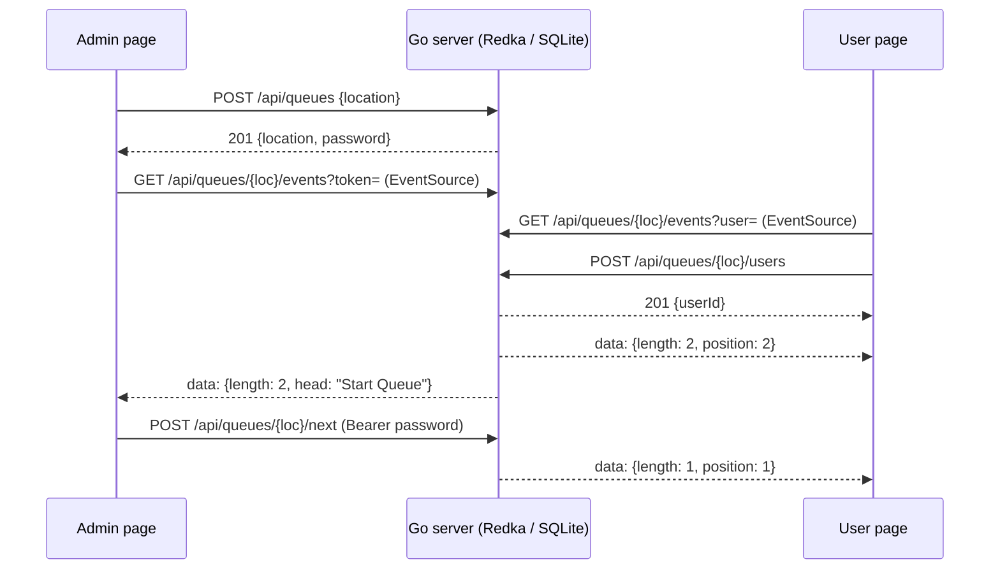

# in-person-queue

- [Repository](https://github.com/barakplasma/in-person-queue)
- [Development](#development)

## What is this?

TL:DR; This is a full stack website & server **solution for enabling arbitrary administrators to create location based queues with real-time updates**.

On hold - nearly archived it

## Inspiration

Due to COVID-19, there is a worldwide effort to provide vaccinations to every person on earth. The vaccines currently available must be administered by medical professionals, typically in non-traditional environments (outdoors in places with enough space to socially distance). People are told to patiently queue up (line up) for their vaccine. **We can do better than forcing people to stand in line in order to get vaccinated.**

Instead, there should be a mobile website for people to keep track of their position in a queue. The mobile website should have real-time updates, should work on any internet-enabled phone, and should respect the user's privacy and data. This project aspires to fulfill this need.

If you'd like to keep reading see "Use cases part II" below

## Use cases part II

The Pfizer-BioNTech COVID-19 Vaccine 💉 has a shelf life of 2-8 hours after a carton of doses has been thawed [[citation]](https://www.fda.gov/media/144413/download). Typically, medical professionals thaw and prepare enough doses for everyone with an appointment. However, not everyone with an appointment is ultimately able to show up to their appointments. Thus, there are typically a number of leftover vaccine doses which go to waste every day.

**It is better to make leftover and soon-to-expire vaccine doses available to a nearby waiting list of people desiring vaccination than it is to let them go to waste.**

In Israel 🇮🇱 , there has been a grassroots effort to prevent wasting these leftover doses. In practice, people without appointments queue up at vaccination locations at the end of the day in hopes of getting a vaccine dose from a leftover dose. Medical professionals triage the people in the leftover doses queue according to their risk factors, and provide any leftover doses in order of medical need.

The major problem I noticed while waiting in one of these queues is that it's hard to socially distance while trying to sign up on a single paper waiting list. Then, the medical professional needs to shout out names or numbers, which forces people to stay very close together. This project aspires to enable proper social distancing for people in these queues, or even to check on a queue's length before leaving their home.

An intended use case of this project is to enable medical professionals, or the people in the queue themselves, to organize the queue digitally and easily.

## User Guide

[Implemented: Create queue] Navigate to an instance of In-Person-Queue (see [Deployment](#deployment--hosting--ops) to run your own) and click on "Create queue at my location". By creating a queue, you gain access to administer that queue.
This prompts the browser to ask permission to do a geolocation check. The queue is named after that location as `lat,lon`, rounded to 4 decimals (about 11 meters), so a second admin at the same spot joins the existing queue instead of creating a duplicate. Only the queue admin must provide geolocation access.

[Implemented: ADMIN URL]
Anyone with the admin URL can act as an admin. The admin URL for a queue is a secret for controlling the queue.

[Implemented: ADMIN MESSAGING] An admin can set and update a queue message / title to "shout" to people waiting in that queue. This is a one-to-many communication channel.

[Implemented: SEE NEARBY QUEUES]
People can click "Join a nearby queue" to see a list of nearby queues.

[Implemented: open existing queue] Alternatively, they can navigate to a queue URL (for example `https://your-instance/queue.html?location=32.0800,34.7800`) to join that existing queue.

[TODO: QUEUE STATS] On the queue page, a user can see the current length of the queue. A user can see an estimated waiting time, and the configured capacity of the queue. (it isn't practical to provide an infinite queue with long wait times)

## Deployment / Hosting / Ops

This project is built to be self-hosted: one binary (or container) with an embedded database file, no cloud dependencies, and no third-party requests from the browser. You'll need:

- the binary, or Docker / Kubernetes
- a domain name with HTTPS (browsers only allow geolocation on HTTPS or localhost)

### Quickest: Docker Compose

```sh
git clone https://github.com/barakplasma/in-person-queue.git
cd in-person-queue
docker compose up --build
```

Then open http://localhost:8080. Put any TLS reverse proxy in front of it (e.g. `caddy reverse-proxy --to localhost:8080`).

### Prebuilt image (amd64 + arm64)

Every push to `main` publishes `ghcr.io/barakplasma/in-person-queue:latest`:

```sh
docker run -p 8080:8080 -v queue-state:/data ghcr.io/barakplasma/in-person-queue
```

The volume keeps queues across restarts. The image is `FROM scratch`, runs as UID 65532, and has a `/healthz` endpoint.

### Kubernetes / k3s (Helm)

The chart is published to GHCR as an OCI artifact:

```sh
helm install queue oci://ghcr.io/barakplasma/charts/in-person-queue \
  --namespace queue --create-namespace \
  --set ingress.enabled=true --set ingress.host=queue.example.com --set ingress.tlsSecretName=queue-tls
```

It runs one replica, with `Recreate` updates and a small PVC for the state file. Add `--set rateLimit.enabled=true` for a per-client-IP Traefik rate limit; see the notes in `values.yaml` about real client IPs and shared mobile-carrier IPs. On k3s, the default Traefik ingress streams server-sent events with no extra config. See [`charts/in-person-queue/values.yaml`](charts/in-person-queue/values.yaml) for the options.

Changing anything under `charts/` requires bumping `version` in `Chart.yaml` (CI enforces it), because published chart versions are never overwritten.

### Bare metal / Raspberry Pi

```sh
GOOS=linux GOARCH=arm64 go build -o in-person-queue .   # the web client is embedded
./in-person-queue
```

### Fly.io

`fly.toml` is included: `fly deploy`. Add a [volume](https://fly.io/docs/volumes/) at `/data` to keep queues across deploys.

### Environment Variables

| Variable  | Default                                      | Meaning                                                   |
| --------- | -------------------------------------------- | --------------------------------------------------------- |
| `PORT`    | `8080`                                       | HTTP port                                                 |
| `DB_FILE` | `queues.db` (`/data/queues.db` in the image) | the database file; set to empty for an in-memory database |

Queues expire 24 hours after they are created. Limits: 1,000 people per queue, 10,000 live queues, and 1,000 characters per admin message.

## Development

### Goals

- The most important goal of this project is to enable an ordinary person to create a vaccine leftover queue extremely quickly and easily.
- This project should stay SIMPLE to use and implement. I want any beginner to be able to fork/hack this project to fit their needs. The only simpler alternative to this project should be a paper/pencil/clipboard and a loud voice. See http://boringtechnology.club/ for more details
- The front end must be **accessible**, fast, and work on almost any MOBILE browser.
- The backend should be easy to self-host. The backend should be easy to host on a Raspberry Pi, a digital ocean droplet, or a K8s cluster. This means the backend should be high performance, and simple.
- I respect DevOps, but this project should be NoOps. An operator should ideally be able to set it up on a brand new rasberry pi once and never login to it again.

### Technical Design

See [ADR 0001](docs/adr/0001-go-server-without-redis.md) for why it is built this way, and [ADR 0002](docs/adr/0002-embedded-database.md) for the choice of embedded database.

- The front-end is vanilla HTML/JavaScript/CSS, with no build step and no framework, embedded in the binary.
- The back-end is a Go server using only the standard library.
- State lives in an embedded database: [Redka](https://github.com/nalgeon/redka) (Redis data types) on SQLite through the pure-Go `modernc.org/sqlite` driver (see [ADR 0002](docs/adr/0002-embedded-database.md)). Every change is a transaction, fsynced before the response is sent, so nothing is lost on a crash. Inspect it with `sqlite3 queues.db`, and back it up with `sqlite3 queues.db ".backup copy.db"` or Litestream.
- Browsers send changes with `fetch`, and receive live updates through [server-sent events](https://developer.mozilla.org/docs/Web/API/EventSource), which reconnect on their own.

A queue is named after where the admin created it, as `lat,lon` rounded to 4 decimals (about 11 m, e.g. `32.0800,34.7800`), so a second admin at the same spot joins the existing queue.



| Method & path                               | Who    | Purpose                                                |
| ------------------------------------------- | ------ | ------------------------------------------------------ |
| `GET /api/queues?near=<lat,lon>`            | anyone | five nearest queues within 100 km                      |
| `POST /api/queues` `{location}`             | anyone | create a queue; returns `{location, password}`, or 409 |
| `POST /api/queues/{loc}/users`              | anyone | join; returns `{userId}`                               |
| `DELETE /api/queues/{loc}/users/{id}`       | user   | leave                                                  |
| `GET /api/queues/{loc}/events?user=&token=` | anyone | SSE stream of `{length, message, position?, head?}`    |
| `GET /api/queues/{loc}/admin`               | admin  | 204 if the bearer token is the queue's password        |
| `POST /api/queues/{loc}/next`               | admin  | serve the head of the queue                            |
| `PUT /api/queues/{loc}/message` `{message}` | admin  | set the admin message                                  |
| `GET /healthz`                              | probes | liveness/readiness                                     |

### Getting started with localhost

```sh
go run .
```

Visit http://localhost:8080. Use the "Launch server" VS Code config to debug.

### Tests

- `go test -race .` runs the Go tests; there are no external services to start.
- `npm ci && npm run test:e2e` runs the Playwright browser tests in `e2e/`. It starts the Go server for you; run `npx playwright install chromium` once.
- `gofmt -l .`, `go vet .` and `npm run lint` (Prettier + ESLint) cover formatting and lint.

#### Keywords / Buzzwords

- Go
- Server-Sent Events
- Vanilla.js
- Docker
- Helm / k3s

<div>Some Icons made by <a href="https://www.freepik.com" title="Freepik">Freepik</a> from <a href="https://www.flaticon.com/" title="Flaticon">www.flaticon.com</a></div>
