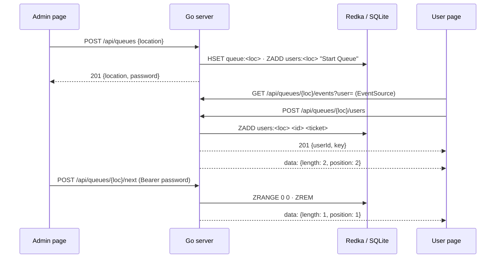

# in-person-queue

Location-based queues with real-time updates, from your phone. An admin creates a queue where they stand. People nearby join it from their phones and watch their position update live, so nobody has to crowd around a paper list or a shouting volunteer.

## Why

It started with leftover COVID-19 vaccine doses in Israel 🇮🇱. Thawed doses only last a few hours, so at the end of the day people lined up at vaccination sites hoping for a leftover dose. Signing a single paper list and shouting names made social distancing impossible.

A queue anyone can start in seconds, that works on any phone browser and respects privacy, solves that. It works just as well for any line where people would rather wait at a distance.

## Using it

1. **Create a queue**: open the site, pick when the queue closes (24 hours from now by default, up to a year), and tap "Create new queue at my location". The queue is named after where you stand, as `lat,lon` rounded to 4 decimals (about 11 m). A second admin at the same spot joins the existing queue instead of making a duplicate. You land on the admin page, and **its URL is the admin password**, so keep it private.
2. **Share it**: send the link shown on the admin page, or people can find it under "Nearby Queues" on the home page.
3. **Join**: people tap "Join Queue" and get a ticket in order (`A001`, `A002`, … `A999`, then `B000`, …) and a live position. Everyone, admin included, sees the line in order with when each ticket joined.
4. **Serve**: the admin taps "Current user done" to serve whoever is at the head of the queue. Everyone's position updates instantly.
5. **Message**: the admin can post a message, such as what the queue is for or what to bring, which everyone in the queue sees.
6. **Display mode**: the admin page links to a full-screen display for a tablet, TV or laptop facing the line. It shows who is being served, the next few tickets (`?top=5` by default), the admin message, the estimated wait and the join link. It needs no password, so it is safe to leave on a public screen.

Everyone sees an **estimated wait**: per ticket in the line, for themselves, and for someone joining now. It is measured from how fast the admin actually serves people (see [ADR 0003](docs/adr/0003-wait-time-estimate.md)), and reads "estimating…" until the first person is served.

The location links open the phone's maps app (Apple Maps on iOS, the default `geo:` app on Android), with an OpenStreetMap link as a fallback. Queues close at the time their admin picked.

## Running it

It is one binary, or one small container, with an embedded database file. There are no other services, no cloud dependencies, and no third-party requests from the browser. Browsers only allow geolocation over **HTTPS** (or on localhost), so put it behind TLS.

### Docker Compose

```sh
git clone https://github.com/barakplasma/in-person-queue.git
cd in-person-queue
docker compose up --build   # http://localhost:8080
```

### Container image (amd64 + arm64)

```sh
docker run -p 8080:8080 -v queue-data:/data ghcr.io/barakplasma/in-person-queue
```

The image is `FROM scratch`, runs as UID 65532, keeps its database in `/data`, and has a `/healthz` endpoint.

### Kubernetes / k3s (Helm)

```sh
helm install queue oci://ghcr.io/barakplasma/charts/in-person-queue \
  --namespace queue --create-namespace \
  --set ingress.enabled=true --set ingress.host=queue.example.com --set ingress.tlsSecretName=queue-tls
```

- One replica with `Recreate` updates, plus a small PVC for the database.
- On k3s, the default Traefik ingress streams the live updates with no extra config.
- `--set rateLimit.enabled=true` adds a per-client-IP Traefik rate limit. See [`values.yaml`](charts/in-person-queue/values.yaml) for the caveats about real client IPs.

### Binary

```sh
go build -o in-person-queue .   # the web client is embedded; cross-compiles with GOOS/GOARCH, no cgo
./in-person-queue
```

### Configuration

| Variable  | Default                                      | Meaning                                     |
| --------- | -------------------------------------------- | ------------------------------------------- |
| `PORT`    | `8080`                                       | HTTP port                                   |
| `DB_FILE` | `queues.db` (`/data/queues.db` in the image) | database file; set to empty for memory only |

Limits: 1,000 people waiting per queue, 25,999 tickets per queue (`A001`…`Z999`), 10,000 live queues, 10,000 characters per admin message.

### Operations

- **Inspect** the data with `sqlite3 queues.db`; it's a normal SQLite file.
- **Back up** with `sqlite3 queues.db ".backup copy.db"` while the server is running, or continuously with [Litestream](https://litestream.io).
- **Health**: `GET /healthz`. The binary also has a `-healthcheck` flag for Docker's `HEALTHCHECK`.
- **Shutdown**: `SIGTERM` closes live connections and waits for in-flight requests. Every change is committed before it is acknowledged, so a crash loses nothing.

## How it works

The design favours boring, established building blocks over clever code ([ADR 0001](docs/adr/0001-go-server.md), [ADR 0002](docs/adr/0002-embedded-database.md)):

- **Server**: Go standard library: `net/http`, `embed`, `log/slog`.
- **Storage**: [Redka](https://github.com/nalgeon/redka), which provides Redis data types on SQLite, through the pure-Go [`modernc.org/sqlite`](https://pkg.go.dev/modernc.org/sqlite) driver. Each queue is a hash (password hash, message, expiry, join times) plus a sorted set of people scored by ticket number. A person's position is their rank + 1.
- **Live updates**: [server-sent events](https://developer.mozilla.org/docs/Web/API/EventSource). Browsers reconnect on their own.
- **Client**: plain HTML/JS with [mvp.css](https://andybrewer.github.io/mvp/). No build step, no framework, embedded in the binary.



| Method & path                               | Who    | Purpose                                                                                             |
| ------------------------------------------- | ------ | --------------------------------------------------------------------------------------------------- |
| `GET /api/queues?near=<lat,lon>`            | anyone | the five nearest queues within 100 km                                                               |
| `POST /api/queues` `{location, closes?}`    | anyone | create a queue closing at `closes` (RFC 3339, default 24 h); returns `{location, password}`, or 409 |
| `POST /api/queues/{loc}/users`              | anyone | join; returns `{userId, key}`                                                                       |
| `DELETE /api/queues/{loc}/users/{id}`       | user   | leave, with the join `key` as bearer token                                                          |
| `GET /api/queues/{loc}/events?user=&token=` | anyone | SSE stream of `{length, message, people, closes, serviceSeconds?, position?, head?}`                |
| `GET /api/queues/{loc}/admin`               | admin  | 204 if the bearer token is the queue's password                                                     |
| `POST /api/queues/{loc}/next`               | admin  | serve the head of the queue                                                                         |
| `PUT /api/queues/{loc}/message` `{message}` | admin  | set the admin message                                                                               |
| `GET /healthz`                              | probes | liveness and readiness                                                                              |

## Development

```sh
go run .   # http://localhost:8080; use the "Launch server" VS Code config to debug
```

Or open the repo in its [dev container](.devcontainer/devcontainer.json) (VS Code, Codespaces, or `devcontainer up`): it comes with Go, Node and Playwright's Chromium, ready to run every check below.

Tests:

- **Go**: `go test -race .` runs the store and HTTP API tests against an in-memory database. There are no services to start.
- **Browser**: `npm ci && npx playwright install chromium && npm run test:e2e` runs the Playwright tests in `e2e/` against `go run .`. Node is only used for this and for linting.
- **Lint and format**: `gofmt`, `go vet`, `npm run lint` (Prettier and ESLint).

CI on a pull request runs one fast `build` job: `gofmt`, `go vet`, `go test`, Prettier, ESLint and `helm lint`. On `main` it also runs the deeper checks (`go test -race` on amd64 and arm64, `govulncheck`, the Playwright tests, chart manifest validation), and only when all pass does it publish the image and the chart to GHCR. Changing anything under `charts/` requires bumping `version` in `Chart.yaml`, because published chart versions are never overwritten.

To release, bump `appVersion` in `Chart.yaml` and add `docs/releases/<appVersion>.md` (a `# ` title line, then the notes). CI creates the GitHub release and its tag when that reaches `main`.

Some icons by [Freepik](https://www.freepik.com) from [www.flaticon.com](https://www.flaticon.com/).
