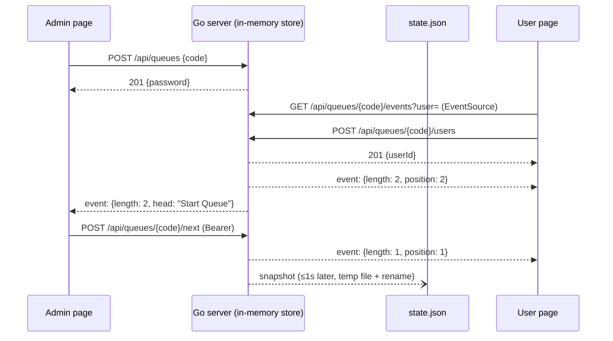

# ADR 0001: Rewrite the server in Go, with no Redis

- Status: Proposed
- Date: 2026-10-03

## Context

The server is Node.js + Socket.io + Redis/Valkey. To run it you need a Node runtime (or an image that has one), a second stateful service (Redis/Valkey), and the Socket.io client in the browser. That's two moving parts plus a protocol library for what is, in data terms, tiny: a few queues at a time, each with up to a few hundred people, all of which expire within 24 hours.

The project's goals (README) are "NoOps", easy to self-host on a Raspberry Pi or a small VPS, and simple enough for a beginner to fork. The maintainer runs k3s on an ARM VPS and prefers Go.

What Redis gives us today, and what replaces it:

| Redis feature used           | Why                            | Go replacement                                     |
| ---------------------------- | ------------------------------ | -------------------------------------------------- |
| Sorted set per queue         | ordered queue, rank = position | `[]string` slice per queue (position = index)      |
| Hash `qm:*`                  | password, admin message        | struct fields                                      |
| Lua scripts / `MULTI`        | atomic join and create         | one `sync.Mutex` around the state                  |
| `EXPIRE`                     | 24h queue lifetime             | `ExpiresAt` field + a sweep on a ticker            |
| `GEOSEARCH`                  | nearby queues                  | linear scan with haversine distance                |
| Durability across restarts   | survive a deploy               | JSON snapshot file, written via temp file + rename |
| Shared state across replicas | scale out with sticky sessions | not kept: one replica (see Consequences)           |

## Decision

Build a single Go binary that serves the static client (via `embed`) and a small JSON-over-HTTP API, and pushes live updates with **Server-Sent Events (SSE)**. All state lives in memory behind one mutex and is snapshotted to a JSON file.

### 1. Transport: SSE + `fetch`, not WebSockets or Socket.io

- Browser → server: plain `fetch` calls to a JSON API.
- Server → browser: one `EventSource` per page.
- Why:
  - SSE is in the Go standard library (`http.Flusher`) and is native in every browser, so there are no dependencies on either side.
  - `EventSource` reconnects on its own. That removes the "lost the room on reconnect" class of bugs we just fixed in the Node version.
  - Updates only flow one way (server → many clients). Requests from clients are rare and fit request/response.
- Rejected:
  - Socket.io has no maintained Go server that speaks its v4 protocol.
  - WebSockets would need a third-party library (`coder/websocket`), and we'd re-implement reconnect ourselves.

### 2. Storage: in-memory state + JSON snapshot

```go
type Queue struct {
    Code         string    // plus code, e.g. "8G4P3QJJ+22"
    PasswordHash [32]byte  // sha256 of the admin password; the plaintext is never stored
    Message      string
    Users        []string  // index 0 = head of queue
    Lat, Lng     float64
    ExpiresAt    time.Time
}

type Store struct {
    mu     sync.Mutex
    queues map[string]*Queue
    subs   map[string]map[chan Event]struct{} // SSE subscribers per queue
}
```

- Every change takes the lock, mutates, and marks the store as dirty. It then notifies the queue's subscribers outside the lock, with non-blocking sends so a slow phone can't stall anyone else.
- A ticker (once a second) writes `state.json.tmp`, fsyncs it and renames it over `state.json`, but only when the store is dirty. Startup reads `state.json` if it exists. A crash loses at most about a second of joins.
- A ticker (once a minute) deletes expired queues.
- Nearby queues: scan every queue and sort by haversine distance. `// ponytail: O(n) scan; add a geohash grid if there are ever >10k live queues`.
- Hard caps, because memory is now the database: 1,000 users per queue, 10,000 live queues, 1,000-character admin message. Requests over a cap get HTTP 429 or 413.
- Rejected:
  - SQLite needs either cgo or a large pure-Go driver, and it's overkill for data that is always under a few MB.
  - bbolt adds a dependency for nothing a JSON file can't do at this size.

### 3. Dependencies

- Standard library, plus one module: Google's official `github.com/google/open-location-code/go`, used to validate and decode plus codes.
- If we want zero dependencies, we can instead port the ~100 lines of decode/validate.

### 4. HTTP API (Go 1.22+ `ServeMux` patterns, no router library)

| Method & path                             | Who    | Purpose                                                                  |
| ----------------------------------------- | ------ | ------------------------------------------------------------------------ |
| `GET /api/queues?near=<code>`             | anyone | five nearest live queues within 100 km                                   |
| `POST /api/queues` `{code}`               | anyone | create a queue; returns `{password}`, or 409 if one already exists there |
| `POST /api/queues/{code}/users`           | anyone | join; **the server generates** the `userId` and returns it               |
| `DELETE /api/queues/{code}/users/{id}`    | user   | leave                                                                    |
| `GET /api/queues/{code}/events?user=<id>` | anyone | SSE stream: `{length, message, position}` on every change                |
| `POST /api/queues/{code}/next`            | admin  | serve the head of the queue                                              |
| `PUT /api/queues/{code}/message`          | admin  | set the admin message                                                    |
| `GET /healthz`                            | k8s    | liveness/readiness                                                       |

- Admin calls send `Authorization: Bearer <password>`, which is checked with `subtle.ConstantTimeCompare` against the stored hash.
- The SSE stream is personalised: with `?user=`, each event carries that user's position, so the client never asks for it separately.
- The admin view gets `head` in its events when the stream is opened with a valid bearer token. `EventSource` can't set headers, so the token goes in `?token=` over HTTPS.



### 5. Client

- Keep the three HTML pages, mvp.css and the vendored Open Location Code library.
- Replace the Socket.io calls with `fetch` and `EventSource`.
- Delete the Socket.io client and `request()` helper; the client gets about 30% smaller.

### 6. Packaging and running

- `go build` → one ~10 MB static binary with the client embedded.
- Multi-arch images are built by cross-compiling with `GOARCH=arm64`, so no QEMU emulation in CI.
- `FROM scratch` image, running as non-root with UID 65532.
- `-healthcheck` flag so the Docker `HEALTHCHECK` works without `wget` in the image.
- Config through env vars: `PORT`, `STATE_FILE` (default `./state.json`; empty means memory only).
- k3s: the existing Helm chart (`charts/in-person-queue`) changes like this:
  - the bundled Valkey and its password secret are removed;
  - the app Deployment gets `replicas: 1`, `strategy: Recreate`, and a 10 Mi PVC mounted at the `STATE_FILE` path;
  - probes switch to `httpGet /healthz`.

  The values for image, ingress and resources stay the same, so `helm upgrade` is the whole cutover.

- Graceful shutdown uses `signal.NotifyContext` → `server.Shutdown`, which closes SSE streams so browsers reconnect to the new pod, then writes a final snapshot.

### 7. Migration

1. Add the Go server at the repo root (`go.mod`, `main.go`, `store.go`, `api.go`), embedding `client/`.
2. Rewrite the client for SSE/fetch.
3. Run the **existing Playwright e2e suite** against the Go server. The selectors don't change, so the suite is the acceptance test. Port the `node:test` unit tests to `go test` against `Store`, plus `httptest` for the API.
4. Delete the Node server, `package.json` runtime deps, Redis/Valkey from compose and CI. Keep Node only as a dev dependency for Playwright.
5. Cut over. No data migration: queues live at most 24 hours. Old v1/v2 links keep working because the URL shape (`queue.html?location=<code>`) is unchanged.

## Consequences

Good:

- One process, one binary, one optional file. `docker run -p 8080:8080 ghcr.io/barakplasma/in-person-queue` is the whole deployment; on a Pi it's `./in-person-queue`.
- No Redis to secure, patch, back up or license-audit.
- Atomicity is a mutex instead of Lua scripts, which beginners can read.
- Reconnect handling is the browser's job (`EventSource`).
- Faster cold start; about 10 MB of RAM idle.

Bad / accepted:

- **One replica only.** State is in-process, so no horizontal scaling and a few seconds of downtime per deploy (`Recreate`). At the expected load (one Go process handles tens of thousands of SSE connections) this is fine.
  - Upgrade path if it's ever needed: put a pub/sub (NATS) between replicas, or move state to Postgres with `LISTEN/NOTIFY`.
- Up to about 1 second of writes can be lost on a hard crash (not on a graceful shutdown).
- SSE over HTTP/1.1 is limited to 6 connections per browser per host. Each page uses one, and HTTP/2 behind any TLS proxy removes the limit.
- The admin token appears in the SSE URL query. That's acceptable over HTTPS; it's already in the admin page URL today.
- A JavaScript toolchain remains only for Playwright e2e tests.

## Alternatives considered

1. **Keep Node, drop Redis (in-memory + JSON file).** Smallest change, but keeps the Node runtime and Socket.io, and the maintainer prefers Go.
2. **Go + embedded SQLite.** Real durability and queries, but cgo or a large dependency for a dataset of a few KB.
3. **Go + WebSockets (`coder/websocket`).** Bidirectional, but one more dependency and hand-written reconnect logic, for traffic that is almost entirely server → client.
