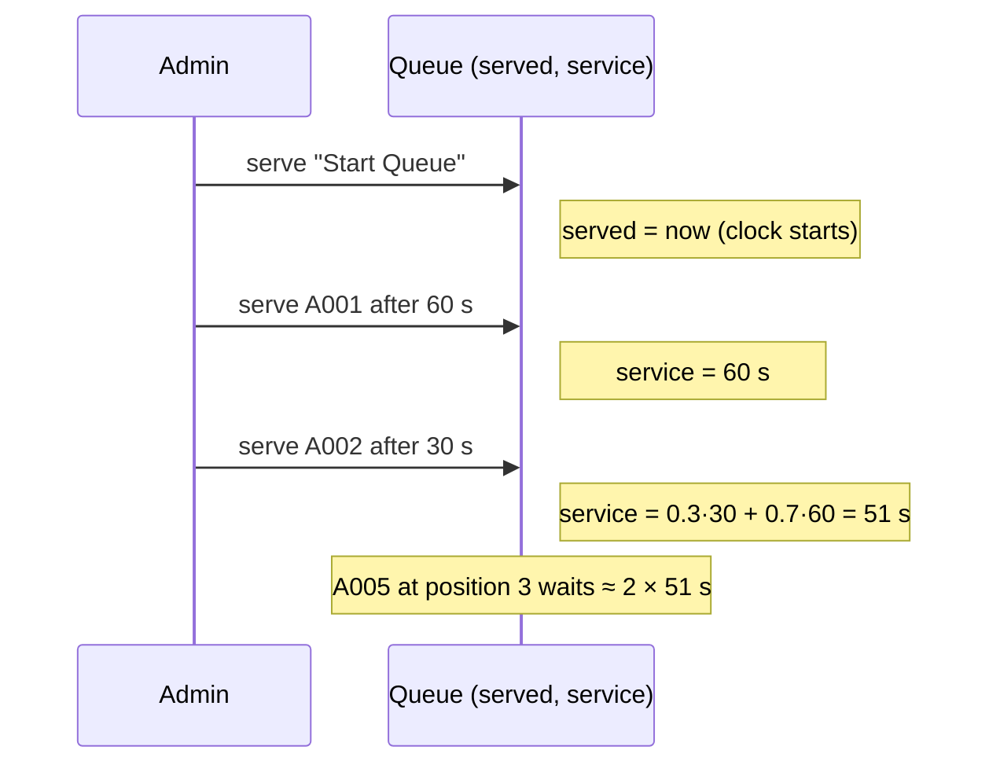

# ADR 0003: Estimated wait time

- Status: Accepted (2026-10-03)

## Context

People in line, and the display screen, should see roughly how long they will wait. The estimate has to:

- work with no setup: admins don't enter an expected time per person;
- follow the real pace, which changes during the day (a new volunteer, a slow case);
- be simple enough to explain and test, with nothing more to run.

## Decision

Treat each queue as a **single-server queue** and estimate its **service time** from the admin's own serves.

- **Wait at position _p_ ≈ (_p_ − 1) × _S_**, where _S_ is the average time to serve one person. Position 1 is being served now. Someone joining now waits about _length_ × _S_.
  - This follows from [Little's law](https://en.wikipedia.org/wiki/Little%27s_law) (_L_ = _λW_). With one server working through a first-come, first-served line, the people ahead leave at the service rate 1/_S_.
  - So only _S_ has to be estimated. No arrival-rate model is needed, because the people ahead of you are already known.
- **_S_ is an exponentially weighted moving average (EWMA)** of the time between serves: _S_ ← 0.3 · _interval_ + 0.7 · _S_.
  - Recent serves count most, so the estimate adapts within a few serves.
  - It needs only two numbers per queue: `served` (the last serve, in ms) and `service` (the average, in ms).
- **Only busy time counts.**
  - Serving the "Start Queue" marker only starts the clock.
  - When someone joins an empty line, the clock restarts.
  - Idle periods therefore don't inflate the estimate.
- Until the first real serve there is no data, and the pages say "estimating…".

## Alternatives considered

- **M/M/1 formulas** (_W_ = 1/(_μ_ − _λ_)): these give the average wait for someone _arriving_, not for a known position in an existing line. They also assume Poisson arrivals and exponential service, and need the arrival rate as well.
- **A plain average since the queue opened**: this reacts slowly when the pace changes.
- **The admin enters a time per person**: it's extra setup, and it goes stale.

## Consequences

- Estimates are rough early on and get better with every serve. People who leave the line (instead of being served) don't count as serves, so they don't distort _S_.
- One number per queue is sent in the event stream (`serviceSeconds`). Pages multiply it by the people ahead, so the server does no per-viewer work.
