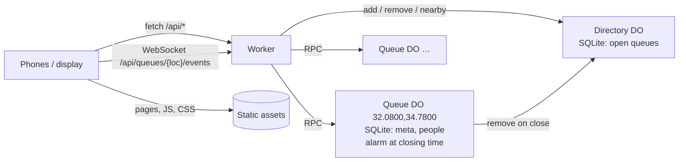

# ADR 0004: Prototype: run on Cloudflare's free plan (and celld)

- Status: Prototype (2026-10-03)

## Context

The Go server ([ADR 0001](0001-go-server.md)) needs somewhere to run it: a VPS, a Raspberry Pi or a k3s cluster. The goal here is that **anyone can run their own copy without a server**, ideally for free and in a couple of clicks.

[celld](https://github.com/denoland/celld) runs Cloudflare Workers apps (Workers, Durable Objects, static assets) on your own machines. So one Workers codebase can run on Cloudflare's free plan, and can later move to celld without a rewrite.

## Decision

Build the same app (the same JSON API and the same web client) as a Workers project in [`cloudflare/`](../../cloudflare), designed for the free plan.

- **One Durable Object per queue**, named by its location. Each object is single-threaded with its own SQLite database, so queues are isolated from each other and every change is serialized without locks. The free plan only offers SQLite-backed Durable Objects, which suits this design.
- **WebSockets instead of server-sent events.**
  - An SSE stream keeps a Durable Object in memory, billed by wall-clock time against the free 13,000 GB-s a day.
  - Hibernating WebSockets (`acceptWebSocket`) let an idle queue leave memory while phones stay connected.
  - Pings are answered by `setWebSocketAutoResponse` without waking the object.
  - The only client change is one module, `stream.js`.
- **An alarm at the closing time** deletes the queue's storage, tells connected phones it closed, and removes it from the directory. There is no periodic sweep.
- **One `Directory` object** answers "nearby queues": a latitude band in SQL, then haversine distance. One object for every queue is a known ceiling, fine for thousands of queues; shard it by region if that's ever not enough.
- **Same rules as the Go server**: ticket ids, leave keys (an HMAC of the id keyed by the password hash), the closing-time limits, and the wait estimate ([ADR 0003](0003-wait-time-estimate.md)).
- **Plain JavaScript, no build step**, like the client. Wrangler and celld bundle it themselves.

## Findings from building it

- **Behavior matches the Go server.** The same 14 Playwright tests pass against the Go server, `wrangler dev` and `celld dev` (0.6.1).
- **celld 0.6 rejects two Wrangler config keys**, `build` and the newer `exports`. So the config uses the `migrations` array, and copying the client is an npm script.
- **Static-asset defaults differ.** Workers assets redirect `/admin.html` to `/admin` by default. `html_handling: "none"` keeps exact file names, and the Worker serves `/` itself.
- **The Deploy to Cloudflare button only copies the subfolder**, so `cloudflare/public/` holds a committed copy of `client/`. CI fails if the copy drifts.
- **The Cloudflare API connector can't upload static assets**: that upload needs a session token the connector can't send. Deploys go through Wrangler or the Deploy button (Workers Builds).

## Consequences

Good:

- Anyone can run their own copy for free with one button: no server, TLS or backups to manage. Cloudflare handles the data durability.
- It scales out by construction: queues are independent objects worldwide.
- The same code can move to self-hosting on celld.

Accepted trade-offs:

- **Two servers to keep in step**: Go and Workers. The shared e2e suite guards it.
- **TypeScript-family code** (JavaScript) for the server, instead of Go.
- **The free plan's daily limits** (see [`cloudflare/README.md`](../../cloudflare/README.md#free-plan-budget)). Over a limit, requests fail until 00:00 UTC; nothing is billed.
- **Platform dependency.** Cloudflare (or celld, which is pre-1.0) instead of one binary. The Go server stays the boring default.
