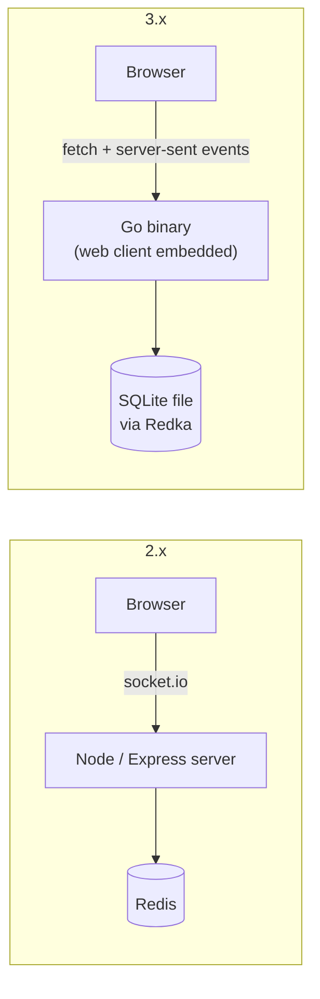

# 3.2.0: rewritten in Go, no Redis, one binary

> **Breaking release.** The server is rewritten from scratch. Nothing from 2.x carries over: no data, no URLs, no API, no config. Queues expire within 24 hours anyway, so just deploy it fresh.

## Why

The goal for 3.x is an app that's **boring and stable to run**: easy to self-host on a Raspberry Pi, a small ARM VPS or a k3s cluster, built on established projects instead of hand-rolled code. See [ADR 0001](https://github.com/barakplasma/in-person-queue/blob/3.2.0/docs/adr/0001-go-server.md) and [ADR 0002](https://github.com/barakplasma/in-person-queue/blob/3.2.0/docs/adr/0002-embedded-database.md).



## Benefits

- **One process, one file, no Redis.** The data lives in an embedded SQLite database ([Redka](https://github.com/nalgeon/redka) gives it Redis-style data types), so the whole deployment is `docker run` or `helm install`.
  - Every change is committed with `synchronous=full` before it is acknowledged, so a crash loses nothing.
  - Inspect it with `sqlite3 queues.db`; back it up with `.backup` or Litestream.
- **Small and runs anywhere.** One static, cgo-free Go binary. The image is a 17 MB `FROM scratch` image for amd64 and arm64, running as non-root UID 65532.
- **Few dependencies.** The server is the Go standard library plus the embedded database. The browser client is plain HTML/JS with no build step. Node is only dev tooling (Playwright, Prettier, ESLint).
- **Live updates the boring way.** Server-sent events replace socket.io: built into every browser, reconnects on its own, no client library.
- **Easier to deploy.** There's a Helm chart (`oci://ghcr.io/barakplasma/charts/in-person-queue`) with an optional Traefik rate limit, a `docker-compose.yml`, and a `/healthz` endpoint.
- **Safer.**
  - The admin password is random, stored only as a SHA-256 hash and compared in constant time.
  - Pages send a strict Content-Security-Policy, `nosniff` and `no-referrer`.
  - User text is never rendered as HTML.
  - Inputs are validated and size-capped.
  - CI runs `govulncheck`.
- **Tested.** Store and API tests run with `-race` on amd64 and arm64, plus Playwright end-to-end tests against the real binary.

## What's new for people using it

- **Ticket numbers**, like at an Israeli post office: `A001` … `A999`, then `B000` … `Z999`.
- **The line is visible**: the admin and everyone in the queue see who is in line, in order, with when they joined.
- **Map links open the phone's maps app**: Apple Maps on iOS, the default `geo:` app (usually Google Maps) on Android, with an OpenStreetMap fallback link.
- **Nearby queues show their distance** (`350 m`, `2.4 km`), closest first.
- **Longer admin messages**, up to 10,000 characters.
- An updated [mvp.css](https://andybrewer.github.io/mvp/), served locally with no third-party requests.

## Breaking changes

- **Server.**
  - Node/Express/socket.io is replaced by the Go server.
  - Redis is no longer used, and 2.x data is not migrated.
- **Locations.**
  - Queues are named by plain `lat,lon`, rounded to 4 decimals (~11 m), instead of Plus Codes.
  - Old queue links don't work.
- **API.**
  - The socket.io events are gone.
  - The new JSON API under `/api/queues` plus the SSE stream is documented in the [README](https://github.com/barakplasma/in-person-queue/blob/3.2.0/README.md#how-it-works).
- **User ids.**
  - Ids are now sequential ticket numbers instead of random strings.
  - Because tickets are easy to guess, leaving a queue now needs the `key` returned when you join. The queue page keeps it in its URL.
- **Configuration.**
  - The only settings are `PORT` (default `8080`) and `DB_FILE` (default `queues.db`, `/data/queues.db` in the image).
  - `REDIS_CONNECTION_STRING` and `CORS_ORIGIN` are removed, and the default port changed from 3000 to 8080.
- **Container.**
  - The image is now `ghcr.io/barakplasma/in-person-queue`, tagged `latest`, the version and the commit SHA.
  - It listens on port 8080 and keeps its data in the `/data` volume.

## Get it

```sh
docker run -p 8080:8080 -v queue-data:/data ghcr.io/barakplasma/in-person-queue:3.2.0
# or
helm install queue oci://ghcr.io/barakplasma/charts/in-person-queue --version 0.3.1
```

Browsers only allow geolocation over HTTPS, so put it behind TLS.

**Full changelog**: https://github.com/barakplasma/in-person-queue/compare/2.1.0...3.2.0
